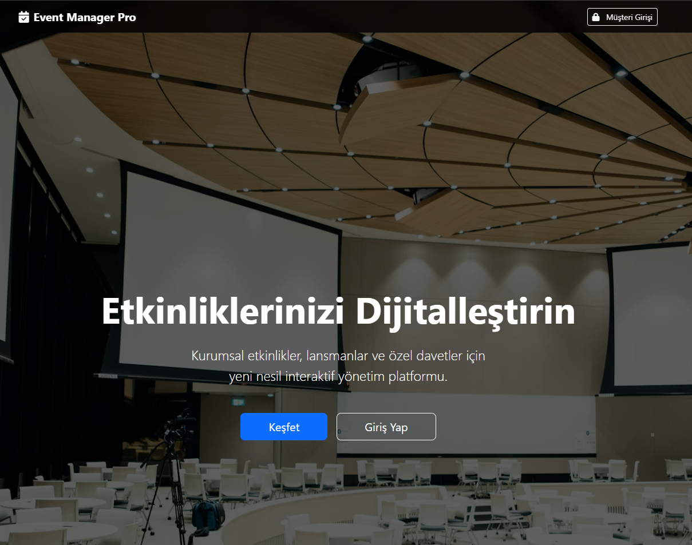

# Event Manager Pro 🚀

**Event Manager Pro**, kurumsal etkinlikler, lansmanlar, düğünler ve özel davetler için geliştirilmiş; uçtan uca dijital deneyim sunan, **PHP** tabanlı kapsamlı bir etkinlik yönetim sistemidir.

Misafir kaydından QR kodlu girişe, canlı fotoğraf duvarından (Live Wall) interaktif oylamalara kadar bir etkinliğin ihtiyaç duyduğu tüm dijital araçları tek bir çatıda toplar.



## 🌟 Öne Çıkan Özellikler

### 🎟️ QR Biletleme & Kapı Kontrolü
* **Dijital Kayıt:** Misafirler etkinlik sayfasına giderek kayıt olabilir.
* **PDF Bilet:** Kayıt sonrası otomatik oluşturulan QR kodlu PDF bilet.
* **E-Posta Bildirimi:** Kayıt olanlara otomatik "Hoş Geldiniz" maili ve takvim (ICS) dosyası gönderimi.
* **Kapı Check-in:** Görevliler, admin panelindeki QR okuyucu ile misafirleri saniyeler içinde içeri alabilir.

### 📺 Live Wall (Canlı Sosyal Duvar)
* Misafirler etkinlik anında çektikleri fotoğrafları sisteme yükleyebilir.
* **Moderasyon Paneli:** Yüklenen fotoğraflar yönetici onayından geçmeden ekrana yansımaz.
* **Dev Ekran Modu:** Onaylanan fotoğraflar, etkinlik alanındaki dev ekranda animasyonlu slayt olarak döner.

### 🎮 Gamification & Etkileşim
* **Canlı Çekiliş (Raffle):** Fotoğraf yükleyen veya check-in yapan misafirler arasında animasyonlu kura çekimi.
* **Canlı Oylama (Polls):** Anlık sorular oluşturun, misafirler telefonlarından oy versin, sonuçlar canlı grafiğe dönüşsün.

### 📅 Program Akışı
* Etkinlik takvimi, konuşmacılar ve saat akışı misafirler için temiz bir arayüzde sunulur.

### 🔐 Çoklu Yönetim Paneli
* **Super Admin:** Sistemdeki tüm etkinlikleri, müşterileri (firmaları) yönetir.
* **Client Admin (Müşteri):** Sadece kendi etkinliğini yönetir, rapor alır, moderasyon yapar.

---

## 🛠️ Kurulum Adımları

Projeyi kendi sunucunuzda (localhost veya hosting) çalıştırmak için aşağıdaki adımları izleyin:

### 1. Dosyaları Yükleyin
Proje dosyalarını sunucunuzun ana dizinine (`public_html` veya `htdocs`) yükleyin.

### 2. Veritabanını Oluşturun
* PhpMyAdmin veya benzeri bir araçla yeni bir veritabanı oluşturun (Örn: `event_db`).
* Ana dizindeki **`event_db.sql`** dosyasını bu veritabanına içe aktarın (Import).

### 3. Ayarları Yapılandırın
* `config/database.example.php` dosyasının adını **`database.php`** olarak değiştirin.
* Dosyayı açın ve veritabanı bilgilerinizi girin:
    ```php
    return [
        'host'     => 'localhost',
        'dbname'   => 'event_db',
        'username' => 'root',
        'password' => '',
        'charset'  => 'utf8mb4'
    ];
    ```

### 4. Mail Ayarları (Opsiyonel ama Önerilir)
* Kayıt maillerinin gitmesi için `src/MailService.php` dosyasındaki SMTP ayarlarını kendi mail sunucunuza göre düzenleyin.

### 5. Yazma İzinleri
* `public/uploads` klasörüne ve alt klasörlerine yazma izni (CHMOD 777 veya 755) verildiğinden emin olun.

---

## 📖 Kullanım Kılavuzu

### Yönetici Girişleri
Sisteme erişmek için `/views/auth/login.php` sayfasına gidin veya anasayfadaki "Giriş Yap" butonunu kullanın.

* **Varsayılan Super Admin:**
    * Kullanıcı Adı: `admin`
    * Şifre: `123456` (Veritabanındaki hash'e göre değişebilir, ilk kurulumda manuel eklemeniz gerekebilir)

### Etkinlik Oluşturma
1.  Super Admin paneline girin.
2.  "Yeni Etkinlik Oluştur" butonuna tıklayın.
3.  Etkinlik bilgilerini girin ve yönetici olacak müşteriyi seçin (veya yeni oluşturun).
4.  Oluşan "Slug" (URL) üzerinden misafirler etkinliğe erişebilir. (Örn: `site.com/public/yilbasi-partisi`)

---

## 💻 Teknolojiler

Bu proje aşağıdaki teknolojiler kullanılarak geliştirilmiştir:

* **Backend:** PHP 8+ (PDO, OOP Mimarisi)
* **Veritabanı:** MySQL
* **Frontend:** HTML5, CSS3, Bootstrap 5
* **JavaScript Kütüphaneleri:**
    * `QRCode.js` & `html5-qrcode` (Biletleme sistemi için)
    * `Chart.js` (Oylama sonuçları için)
    * `Canvas Confetti` (Çekiliş animasyonları için)
    * `Animate.css` (Görsel efektler için)
* **Dış Kütüphaneler:** PHPMailer, HTML2PDF

---

## 📂 Klasör Yapısı

event-manager-pro/
├── config/
│   ├── config.php
│   └── database.example.php
├── lang/
│   ├── en.php
│   └── tr.php
├── public/
│   ├── assets/
│   │   ├── css/
│   │   │   └── style.css
│   │   └── img/
│   │       └── frame.png
│   ├── uploads/ (Kullanıcı yüklemeleri buraya gelecek)
│   ├── .htaccess
│   └── index.php
├── src/
│   ├── PHPMailer/
│   │   ├── Exception.php
│   │   ├── PHPMailer.php
│   │   └── SMTP.php
│   ├── Auth.php
│   ├── Database.php
│   ├── Language.php
│   └── MailService.php
├── views/
│   ├── auth/
│   │   └── login.php
│   ├── client_admin/
│   │   ├── checkin.php
│   │   ├── dashboard.php
│   │   ├── download-zip.php
│   │   ├── guests.php
│   │   ├── navbar.php
│   │   ├── polls.php
│   │   ├── raffle.php
│   │   ├── schedule.php
│   │   ├── session_details.php
│   │   ├── session_scan.php
│   │   └── sessions.php
│   ├── frontend/
│   │   ├── landing.php
│   │   ├── navbar_bottom.php
│   │   ├── poll-results.php
│   │   ├── register.php
│   │   ├── ticket.php
│   │   ├── timeline.php
│   │   ├── upload.php
│   │   ├── vote.php
│   │   └── wall.php
│   ├── layouts/
│   │   └── header.php
│   ├── super_admin/
│   │   ├── dashboard.php
│   │   ├── event-create.php
│   │   ├── event-edit.php
│   │   └── users.php
│   └── home.php
├── .gitignore
├── event_db.sql
├── index.php
├── logout.php
└── README.md
---

## 📄 Lisans

Bu proje açık kaynaklıdır. Ticari kullanım için geliştirici ile iletişime geçiniz.

**Geliştirici:** Sevcan Çil
